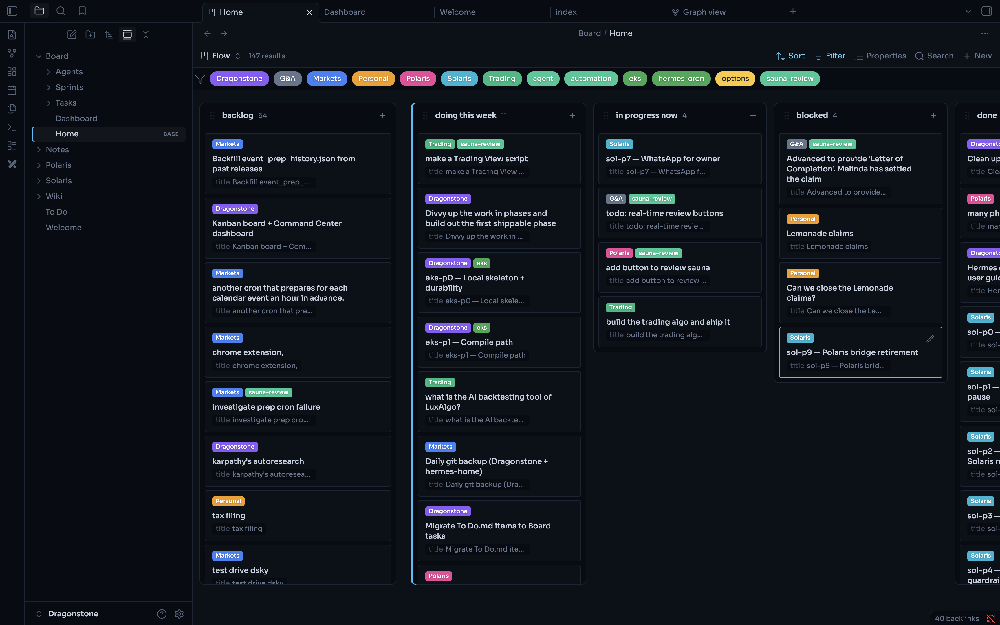
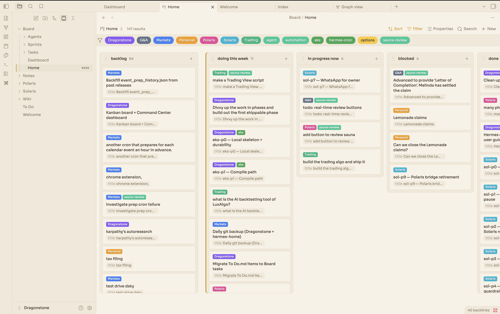
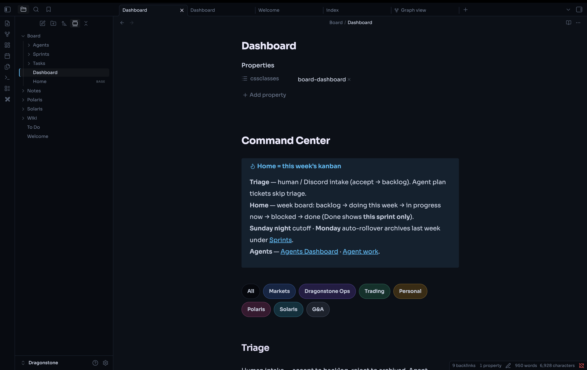
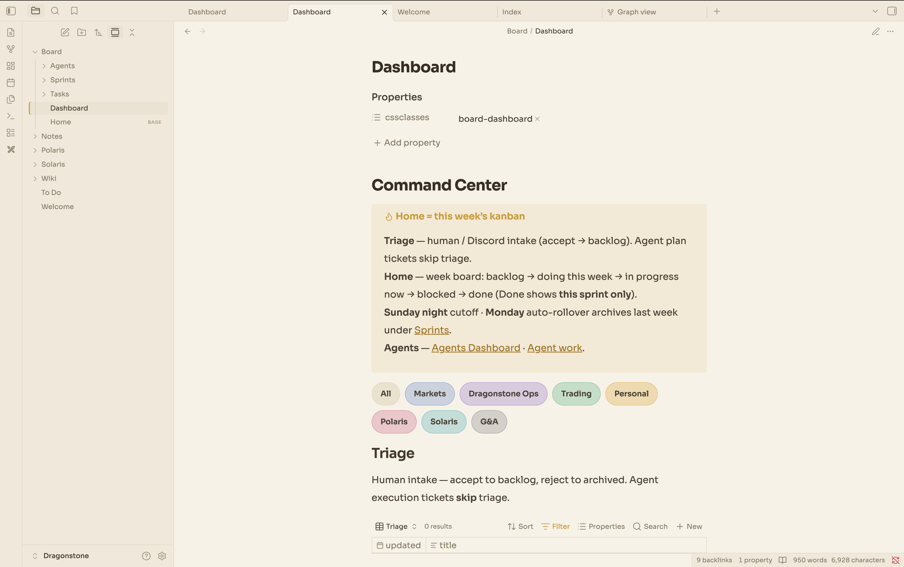

<p align="center">
  
  
</p>

<p align="center">
  <strong>Markdown-native project board for humans and AI agents</strong><br/>
  Local-first · Git-friendly · Obsidian-ready · Zero SaaS
</p>

<p align="center">
  <a href="#install">Install</a> ·
  <a href="#quick-start">Quick start</a> ·
  <a href="#how-it-works">How it works</a> ·
  <a href="docs/humans.md">Humans</a> ·
  <a href="docs/agents.md">Agents</a> ·
  <a href="docs/safety.md">Safety</a>
</p>

---

> **Solaris** turns any folder or git repo into a self-contained project board.
> Tasks are plain Markdown. Agents create tickets and move them as they work.
> You approve the plan once — not every card.

**Solaris** = *Sol* (the Sun) + *Polaris* (the North Star). For millennia those two lights
guided travellers and world-builders — Sol by day, Polaris by night.

Solaris keeps you on course, day and night.

| Dark | Light |
|------|-------|
|  |  |
|  |  |

## Why Solaris

| Problem | Solaris |
|---------|---------|
| PM tools live in someone else's cloud | Files in **your** repo / vault |
| Agents drown you in untracked work | Automatic ticket ledger + live lanes |
| Humans can't review thousands of tickets | Approve the **plan** once; board is a log |
| Obsidian boards aren't portable | Same schema works in a bare git repo |

## Install

### 1. Solaris CLI (required)

```bash
python3 -m venv .venv && source .venv/bin/activate
pip install "git+https://github.com/DevMandalia/Solaris.git"

# or from a local clone
pip install -e ".[dev]"
```

CLI: **`solaris`** (also `python -m solaris`).  
Requires Python 3.10+.

### 2. Obsidian app (optional — for the kanban UI)

Solaris does **not** install the Obsidian desktop app. Install it yourself, then open the repo as a vault.

| OS | Install |
|----|---------|
| **macOS** | [Download](https://obsidian.md/download) or `brew install --cask obsidian` |
| **Windows** | [Download](https://obsidian.md/download) (installer / Windows Store) |
| **Linux** | [Download](https://obsidian.md/download) (AppImage / Flatpak / community packages) |

Use **Obsidian 1.10+** so the core **Bases** feature is available (Base Board depends on it).

The separate note-taking agent uses **`solaris-agent`** (`hermes -p solaris`) — unrelated to the board CLI.

## Quick start

```bash
# In any project directory
solaris init --name MyApp --project Eng --obsidian
export BOARD_ROOT=$PWD

# If you used --obsidian: install Obsidian.app (above), then
# Obsidian → Open folder as vault → this directory
# Allow community plugins if prompted (Base Board). Theme: Nebula.

solaris agent register --id my-bot --name "My Bot" --model gpt --owner You
solaris agent plan-open --agent my-bot --title "Add auth" --project Eng
# note the plan_id printed, then:
solaris task create --title "Add auth" --project Eng --build \
  --agent my-bot --plan-id <plan_id> --lane "doing this week"
solaris task move add-auth --lane "in progress now"
# ... do the work ...
solaris task move add-auth --lane done
solaris agent plan-close <plan_id> --lines-added 120 --lines-removed 10 --prs 1

solaris export --include-done
```

### Vault mode (Obsidian)

```bash
solaris init --name MyApp --project Eng --obsidian
```

Creates the board files **plus** `.obsidian/` with:

- **Bases** (core plugin) enabled  
- **Base Board** community plugin vendored  
- **Nebula** theme selected  

Then install Obsidian.app (see above) → **Open folder as vault** on the repo root → open `<board_dir>/Home.base` / Dashboard.

Without `--obsidian`, you still get markdown + `Home.base`; open the folder as a vault manually and install plugins/themes yourself.

### Repo mode (no Obsidian)

```bash
solaris init --name MyApp --project Eng   # omit --obsidian
```

Use the CLI only. Commit `<board_dir>/` with your code. `solaris export` prints a markdown kanban for PRs and status updates.  
Override folder name with `--board-dir Board` if you want the legacy name.

## How it works

```
<repo>/                         # BOARD_ROOT (= Obsidian vault root if using UI)
  .obsidian/                    # only with --obsidian (Bases, Base Board, Nebula)
  <board_dir>/                  # default: basename of repo (or Board)
    config.yml                  # board_dir, projects, feature flags
    Home.base                   # Obsidian kanban (Home, Triage, Agent work)
    Dashboard.md                # command center + WTFAQs
    Agents/                     # entry, INSTANCE, Agents Dashboard, profiles
    Tasks/<Project>/            # one .md file per task
    Sprints/                    # weekly archive + index.md (active_sprint)
    _system/                    # portable schema + templates (vendored on init)
  Wiki/<Project>/index.md
  Notes/
  Welcome.md
  To Do.md
```
**Lanes:** `triage` → `backlog` → `doing this week` → `in progress now` → `blocked` → `done` / `archived`

| Source | Triage? |
|--------|---------|
| Human / intake | Yes |
| `source: agent` | Never |
| `source: roadmap-sync` | Never |

## Agent loop (automatic)

1. Agent **registers** a persistent profile (`solaris agent register`) before any code.
2. You approve a multi-step plan (“execute”).
3. Agent **opens a plan** (`plan-open`, auto session-bind) — wiki plan + ledger — then `task create` with `--agent` / `--plan-id`.
4. Cursor hook / `solaris agent gate-status` blocks other edits until register + plan + todos are in place.
5. As it works: `move` → `in progress now` → `done` (visible on Home.base → Agent work).
6. Agent **closes the plan** with self-reported LOC/PR metrics.
7. History = agent profiles + plan ledgers + task files + git. No per-ticket human gate.

See [docs/agents.md](docs/agents.md).

## Humans

Daily triage, weekly planning/review, WIP — [docs/humans.md](docs/humans.md).

## Safety

- Sprint rollover **aborts** if the ISO week gap is larger than configured (no mass-carry disasters).
- Feature flags default conservative (`sprint_rollover` / `initiative_rollup` off until you enable them).
- Rollup writes only `progress_*` keys — never initiative body or health.
- Cursor **agent-board-gate** (installed by `init`) fail-closes mutations until the agent loop prerequisites are met; Hermes uses `solaris agent gate-status` as preflight.

Details: [docs/safety.md](docs/safety.md).

## CLI reference

```
solaris init [--root DIR] [--name NAME] [--project NAME] [--force]
solaris agent register --id ID --name N --model M --owner O
solaris agent plan-open --agent ID --title T --project P [--initiative-id I]
solaris agent plan-close PLAN_ID --lines-added N --lines-removed N --prs N
solaris agent gate-status | session-bind --plan-id ID | session-unbind
solaris agent dashboard | list [--plans] [--open]
solaris task create --title T --project P [--build] [--agent ID] [--plan-id P]
solaris task move <slug|path> --lane LANE
solaris task edit <slug|path> [--plan ...] [--append-log ...]
solaris task list [--lane L] [--phase X] [--project P] [--agent ID]
solaris export [-o file.md] [--include-done] [--include-archived]
solaris sync
solaris rollover [--dry-run] [--force]
solaris rollup [--dry-run] [--force]
```

Global: `solaris --cwd DIR ...` or `export BOARD_ROOT=/path/to/instance`.

## Concepts

| Concept | Meaning |
|---------|---------|
| **Project** | Top-level area (folder under `Board/Tasks/`) |
| **Initiative** | Multi-step effort with optional wiki hub + health |
| **Task** | One board card = one Markdown file |
| **Lane** | Kanban column (status of work) |
| **Phase** | Label linking a batch of agent tickets |

## Development

```bash
git clone https://github.com/DevMandalia/Solaris.git
cd Solaris
pip install -e ".[dev]"
pytest
```


## License

MIT — see [LICENSE](LICENSE).

## Related

This engine was extracted from a personal vault workflow and designed so **system ≠ content**:
the core ships here; your tasks, projects, and wikis stay in your instance.
