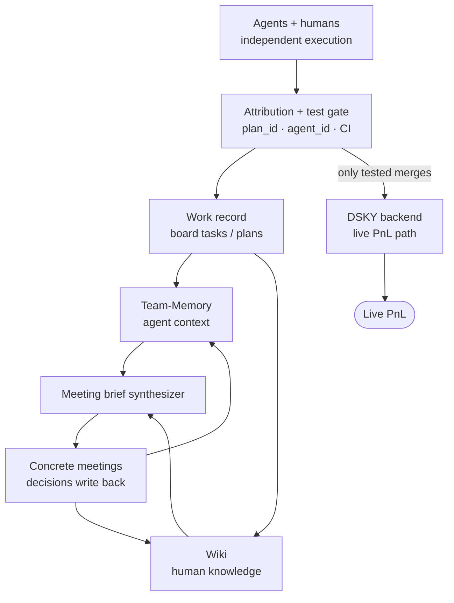
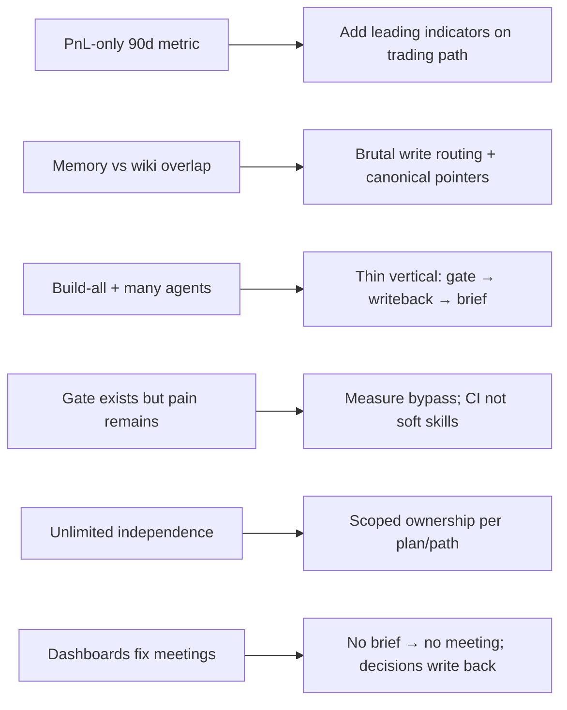
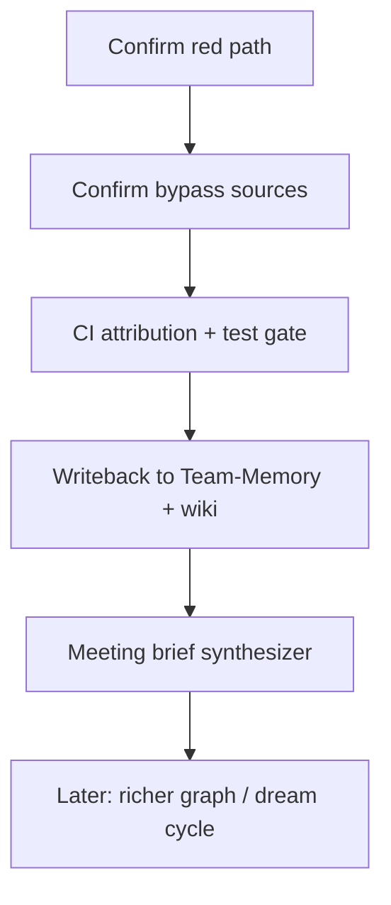

# DSKY multi-agent sync — refined brief

> Companion docs for canvas: `dsky-agent-sync-brief.canvas.tsx`  
> Generated: 2026-08-06 · Follow-on to `solaris-life-os-brainstorm.md` after user answers

## Summary

This is not a Life OS build. It is a **small-team, multi-agent coordination fabric for DSKY** (AI hedge fund): attributable work, mandatory tests on PnL-affecting paths, dual-plane context (Team-Memory for agents, wiki for humans), and meeting briefs synthesized from the work record. North star: **live PnL**. Constraint: **build** and **own data + DSKY backend**.

## Locked answers

| # | Answer | Design implication |
|---|---|---|
| 1 | Small team | Humans + agents as first-class actors |
| 2 | Ignore market events | No competitive-strategy track |
| 3 | Independent agents/humans; weak test/track/context; non-concrete meetings | Job = attribution + test gates + shared context → concrete briefs |
| 4 | Team-Memory = agent context; wiki = human knowledge | Dual write + citation; no silent duplication |
| 5 | Prefer building | Thin vertical first; no vendor SoR |
| 6 | All agents + more, independent | Coordination must be automatic; CI contract not honor system |
| 7 | DSKY live PnL | Lagging north star; need leading indicators on trading path |
| 8 | Own data + DSKY backend | Context starts from DSKY systems of record |

## Working thesis

One sentence: every agent/human action that can affect DSKY is bound to a plan/task, tested before merge, written into shared context, and rollable into meeting briefs that replace status theater.

## What drops / stays

| Idea | Status | Why |
|---|---|---|
| Life OS frameworks / habits | Defer | Pain is multi-agent desync |
| Consumer Unabyss ingest | Defer | Own DSKY data/backend first |
| Buy/host G Brain as SoR | Reject for now | Prefer build; keep swappable seams |
| Solo personal brain | Reject | Small team + many agents |
| Market-events track | Ignore | Per instruction |
| Solaris board + hard gate | Keep / sharpen | Attribution spine |
| Team-Memory + wiki split | Keep / discipline | Agent vs human planes |
| Built brain harness | Keep, narrow | Brief synthesis first, not full dream cycle |
| Testing gate | New first-class | Between push and PnL-affecting merge |

## Challenges to the answers

1. **PnL is too distal alone** — markets dominate short windows. Keep PnL as north star; score the bet on attribution coverage, bypass rate, test pass rate on red paths, meeting hours vs decisions logged, unattributed incidents.
2. **Dual SoR duplicates** unless routing is strict: machine recall → Team-Memory; human narrative/decisions → wiki; execution → board; synthesis cites plane.
3. **Build + fleet scale** exceeds small-team capacity if you chase full G Brain. Ship gate + writeback + brief first.
4. **Solaris gate already exists** — pain implies bypass, missing test/PnL path coverage, or humans not reading the record. Instrument bypass rate; extend hard requirements to CI for all runtimes.
5. **Independence needs contracts** — reserved scopes (plan/workstream/path ownership), not a free-for-all repo.
6. **Meetings need a trusted record** — auto-brief in; decisions out to wiki + tasks.

## Proposed 90-day slice

1. **Attribution spine** — CI requires `plan_id` + actor id on DSKY-affecting PRs (all agent runtimes).
2. **Test gate on red path** — define PnL-moving packages; mandatory checks before merge.
3. **Writeback** — plan-close / Final Summary → Team-Memory distill + wiki changelog (one hook).
4. **Brief synthesizer (harness v0)** — attributable changes, untested diffs, disputes → 1-page meeting input; decisions write back.

### Scoreboard

| Metric | Type | Direction |
|---|---|---|
| % DSKY-path merges with plan_id + actor id | Leading | → 100% |
| Bypass rate | Leading | → 0 |
| Required-check pass rate on PnL paths | Leading | ↑ |
| Meeting hours / decisions logged | Leading | ↓ / ↑ |
| Incidents from unattributed agent work | Leading | ↓ |
| DSKY live PnL | Lagging | Improve vs baseline; don’t sole-kill project |

## Next questions

1. How many humans and persistent agents write to DSKY-related repos?
2. Which paths/packages are the PnL “red path”?
3. Where do agents bypass Solaris today?
4. What objects make a meeting “concrete” when fixed?
5. Is the board the human sync surface, or Slack/Linear?
6. Is “reduce PnL-negative eng-desync incidents” an acceptable 90-day proxy when regime dominates gross PnL?
7. Will teammates accept CI blocks without `plan_id`?

## Sequencing rule

Brief synthesis only works after the work record is complete. Do not build dream-cycle brain before bypass rate collapses.
