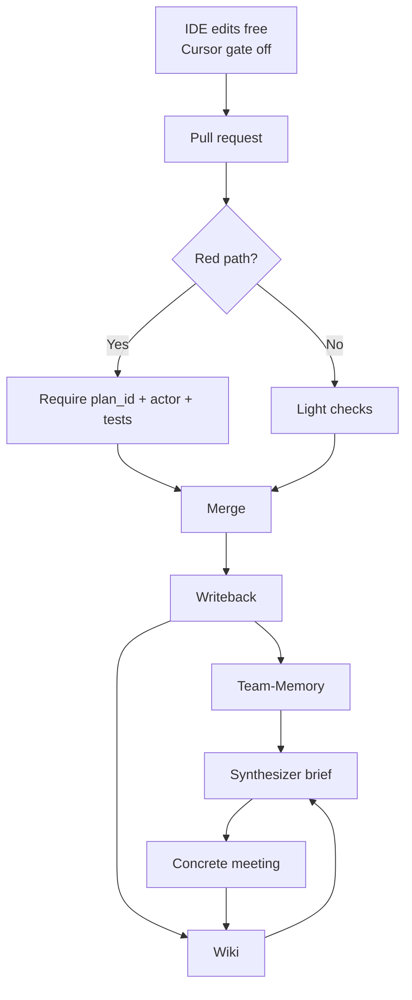
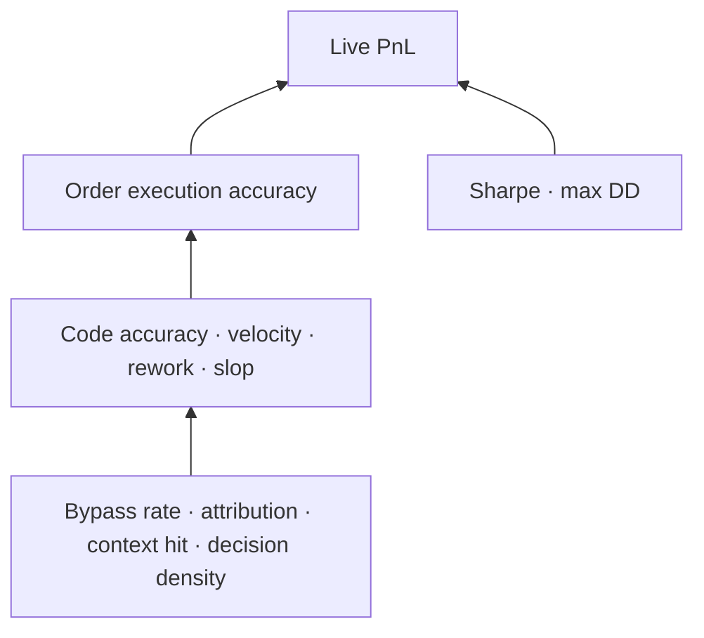

# DSKY coordination plan v2

> Companion docs for canvas: `dsky-coordination-plan-v2.canvas.tsx`  
> Generated: 2026-08-06 · Rolls prior brainstorm answers + new constraints

## Summary

**Team-Memory** becomes the Unabyss-shaped horizontal layer for all agents. **Board** stays execution. **Wiki** stays human decisions. **Cursor hard gate is retired** (buggy / blocks work); plan/PRD proof moves to **path-filtered CI + branch protection**. North star remains **live PnL**; milestones are order accuracy, code accuracy, velocity, rework, slop, plus existing Sharpe/max DD.

Capacity pushback: do not build full Unabyss connector surface and full CI fabric and full synthesizer in parallel on a small fund team. Sequence merge-proof + thin memory distribute first.

## Locked decisions

| Decision | Choice |
|---|---|
| Users | Small team + many independent agents |
| Planes | Board = execution · Team-Memory = agent recall · Wiki = human decisions |
| Horizontal layer | Unabyss-like memory integration **inside Team-Memory** |
| Build vs buy | Prefer build; own DSKY data + backend |
| Cursor hard gate | Disabled — do not rely on it |
| Plan before code | Still required — enforce elsewhere |
| North star | DSKY live PnL |
| Milestones | Order exec accuracy, code accuracy, velocity, rework, slop, trading metrics |

## Glossary

| Term | Meaning | DSKY relevance |
|---|---|---|
| **Red path** | Code/config that can change live trading/risk if wrong | Where mandatory tests + plan proof attach |
| **Independence without scopes** | Many agents, no ownership reservations | Causes overwrite, duplicate work, rework |
| **Meetings ≠ dashboards** | Sync shrinks only when briefs are trusted + decisions write back | Fixes non-concrete meetings |
| **CI attribution** | Merge checks for actor + plan/task id | Replaces IDE hard gate at the repo door |
| **Writeback** | Finish work → Team-Memory + wiki | Stops context dying in one chat |
| **Synthesizer** | Job that builds standup/meeting brief from board+memory+wiki | First useful “brain” feature for your pain |

## Workstreams

| # | Workstream | First ship |
|---|---|---|
| W1 | Team-Memory Unabyss-lite | MCP distribute + scopes; 2–3 sources |
| W2 | Plan proof without Cursor gate | CI plan_id on red packages |
| W3 | Writeback | plan-close → memory + wiki |
| W4 | Synthesizer | Auto standup 1-pager |
| W5 | Metrics plumbing | Slop/rework/velocity next to Sharpe/maxDD |

**Default sequence:** W2 + thin W1 → W3 → W4/W5. Full ingest connectors after merge proof works.

## Memory layer (Unabyss-in-Team-Memory)

Jobs to build: Extract → Structure → Control → Distribute → Two-way writeback.

DSKY-native sources first: DSKY backend, board closes, git/PRs — not Gmail/Notion cosplay.

### Pushback

- “Full Unabyss” is a product; fund team capacity is finite.
- Capture/recall MCP ≠ continuous ingest pipeline.
- Horizontal memory without provenance/evals = rumor network (slop multiplies).

### Mitigations / hacks

- Allowlist 3 sources; manual capture until connectors exist.
- Caller identity on every recall; coarse sensitivity tiers.
- Single write path; don’t dual-write Mem0 until reconcile exists.
- Session-start “recall before code” skill + PR checkbox.

## Gate replacement

**Fact:** Solaris Cursor hook **fail-opens** on infra errors by design; intentional policy denies fail closed. Disabling a buggy blocker is rational; leaving plan-before-code unenforced is not.

| Rung | Mechanism | Notes |
|---|---|---|
| 2–4 (recommended) | CI plan_id + path filter + branch protection | IDE free; merge has teeth |
| 5 | Cursor gate dry_run / warn-only | Measure FPs before re-enable |
| 6 | Hard IDE gate again | Only after dry_run quality is good |
| Break-glass | Label + post-hoc plan ≤24h | Track in synthesizer; quota it |

PRDs stay soft except initiatives / strategy / risk-limit changes. Require **plan_id + task** on red path always.

## Metrics ladder

| Metric | Watch out |
|---|---|
| Slop % | Needs rubric or becomes politics — start with reverts / 72h fix-forwards |
| Order accuracy | Tag causes (strategy vs infra vs desync) |
| Velocity | Pair with rework or it rewards slop |
| PnL | Lagging; regime noise |

Additional: bypass rate, context hit rate, attribution coverage, incident cause class, meeting decision density, duplicate-work incidents, paper↔live drift.

## Further challenges

1. Unabyss-full + build + small team = dual CEO problem → sequence ruthlessly.
2. IDE free + unprotected main = maximum desync → red-path merge proof required.
3. Board as execution fails if humans live in Slack → pick one human sync SoR.
4. Memory ≠ WIP limits; both needed or rework rises with agent count.
5. Order accuracy may not move from eng process — cause-tag or mis-attribute.

## Risks

| Risk | Mitigation |
|---|---|
| Platform eats the fund | WIP platform work; protect trading calendar |
| Memory poisoning | Provenance, promotion rules, contradiction review |
| Empty plan_id theater | CI verifies plan exists + open + linked task |
| Break-glass becomes default | Weekly quota; report in brief |
| Agent identity spoofing | Per-agent CI tokens / bot accounts |

## Follow-up questions

1. Concrete red-path paths/packages?
2. Is deploy branch protected?
3. Which 3 Team-Memory v1 sources?
4. Where do humans actually sync (SoR)?
5. How is slop labeled today?
6. Accept path-filtered CI as hard-gate replacement?
7. Break-glass allowed? Quota?
8. Humans vs agents vs repo count?
9. PRD soft except strategy/risk changes?
10. Mem0 failover keep or cut once ingest deepens?

## This week

Decide **Q3** (three memory sources) and **Q6** (CI replaces IDE gate). Full Unabyss surface before merge proof will not fix “who pushed what.”
