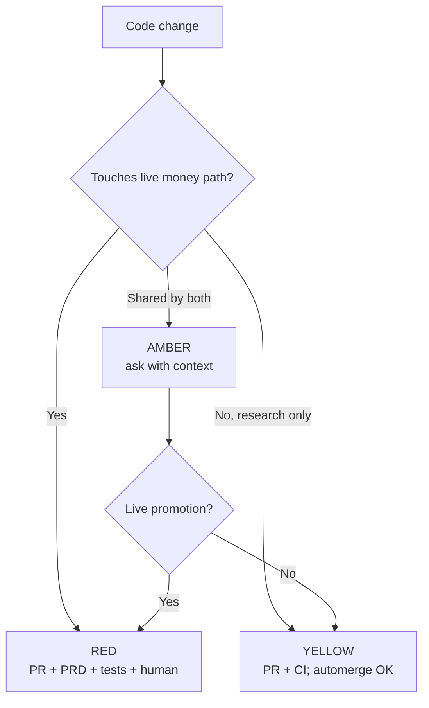
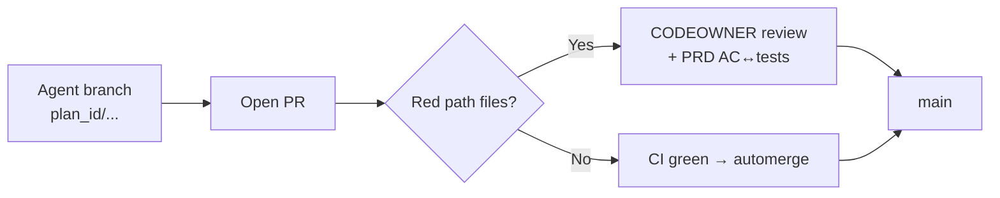

# DSKY coordination plan v3

> Companion docs for canvas: `dsky-coordination-plan-v3.canvas.tsx`  
> Generated: 2026-08-07 · Repo fact-check: `DevMandalia/dsky` (`main.protected = false`)

## Summary

Protect **main** (currently unprotected), require PRs with **anti-spam design**, treat **Alpaca paper execution as RED**, keep **backtests YELLOW**, force **PRD + plan proof + tests on red**, wire **Cursor / Antigravity / Claude / Hermes** into Team-Memory as peer clients, and stop WhatsApp/meetings from being a shadow SoR via writeback to board/wiki.

## Answers rolled in

| # | Answer | Plan implication |
|---|---|---|
| 1 | Red = trading + live execution; yellow = backtest; clarify amber with context | Path policy file + your calls on amber |
| 2 | main not protected; ask about always-PR / PR volume | W0: protect main; PR always; human review only on red; yellow automerge option |
| 3 | Sources: Cursor, Antigravity, Claude, Hermes | These are **clients**, not ingest sources — MCP parity for four runtimes |
| 4 | CI yes with PRD so output tested against intent | AC↔test mapping on red; avoid PRD theater |
| 5 | Humans sync: Board, WhatsApp, meetings | Board = execution SoR; WhatsApp/meetings = transport + mandatory capture |

## Red / yellow map (from Direction-Sky)

### RED (proposed)

| Path | Why |
|---|---|
| `src/dsky/broker/live_execution.py` | Submits to Alpaca |
| `src/dsky/broker/trade_router.py` | Gates + routes |
| `src/dsky/broker/portfolio_runner.py` | Live portfolio daemon |
| `src/dsky/broker/runner.py` | Broker runner |
| `src/dsky/broker/broker_sync.py` | Broker sync |
| `src/dsky/broker/market_data.py` | Live MD for execution |
| `src/dsky/live_policy/**` | Feasible orders / Alpaca constraints |
| `src/dsky/agents/workers/trade_executor.py` | Agent → router |
| `src/dsky/strategies/signal_engine.py` | Live signals |
| `src/dsky/strategies/signal_envelope.py` | Live order contract |
| `src/dsky/strategies/risk_rules.py` | Live risk |
| Alpaca config / deploy / secrets plumbing | Endpoint flip = real money |

**Note:** Alpaca **paper** uses the same execution path → treat as RED.

### YELLOW (proposed)

| Path | Why |
|---|---|
| `src/dsky/research/backtest/**` | Offline research |
| `src/dsky/research/robustness/**` | Research |
| `src/income_strategy_backtest/simulation/**` | ISBT sim |
| Research docs / run artifacts | Non-executing |

### AMBER — need your call

| Path | Context | Ask |
|---|---|---|
| `income_strategy_backtest/rules/engine.py` | Layer 1 for live AND backtest | Always RED, or YELLOW until promotion? |
| `variations.py` | `v19_…` is current live strategy | Live variation edits = RED? |
| `sizing/**` | Used in live portfolio tick | RED if changes sleeve dollars? |
| `src/dsky/portfolio/**` | Docs say offline/archived vs LivePolicy | Reachable = RED? |
| `src/dsky/db/**` + Turso live_ | Corrupt SSOT / PnL views | Migrations RED? |
| `dashboard/api.py` trade-ish | Reads Alpaca; may not submit | Only trigger endpoints RED? |
| `market_intel/**` | Informs, may not execute | YELLOW unless auto-orders? |
| `agents/orchestrator.py` | Can enqueue trade_executor | RED if unsupervised live trades? |

## Always PR? Too many PRs?

**Yes — no direct push to main.** Volume control:

| Pattern | Effect |
|---|---|
| Draft PRs + Ready-for-review | Humans ignore drafts |
| One plan → one PR (or stacked) | Fewer micro-PRs |
| Automerge yellow when CI green | Research doesn’t wake humans |
| CODEOWNERS only on red | Attention where money is |
| Break-glass + quota | Incidents without process death |

## Memory clients vs ingest

**Clients (your list):** Cursor, Antigravity, Claude, Hermes → equal Team-Memory MCP.

**Ingest (still open):** board plan-close, git/PR merges, DSKY Turso live events, WhatsApp, etc.

Wiring four LLMs to memory without DSKY/board/git feeds does not fix “humans don’t know what shipped.”

## PRD-tested CI

| Layer | Check |
|---|---|
| PRD with testable AC | Not empty prose |
| plan_id + tasks | Exist |
| AC↔test mapping | Each AC passed/failed/waived |
| Writeback | Memory + wiki on close |

**Pushback:** essay PRDs → theater. **Hack:** `AC-001` tags linked to `@ac(AC-001)` tests; CI greps coverage on red.

**Scope pushback:** full PRD on every yellow experiment kills research. Prefer PRD mandatory on red + at **live promotion**.

## Human sync

Board = execution SoR. WhatsApp + meetings = transport. Decisions about money/strategy/process must land on board/wiki (paste or bot) or agents stay blind and meetings stay oral.

## Missed from prior round

| Question | Status |
|---|---|
| Slop labeling / judge | Open |
| Break-glass quota | Open |
| Humans vs agents vs repo count | Open |
| Mem0 failover keep/cut | Open |
| Ingest sources (vs clients) | Open |

## Follow-ups

1. Decide each AMBER row.
2. Accept PR-only main + yellow automerge + red CODEOWNER?
3. Pick ≤3 ingest sources for Team-Memory v1.
4. PRD mandatory on red; yellow only at live-promotion — yes/no?
5. WhatsApp: transport+capture vs bot ingest?
6. Break-glass allowed? Quota?
7. Slop = reverts/72h fix-forwards until rubric?
8. Headcount + repo count?

## This week

Ship **W0** (protect main) mentally approved even before amber settles — it is factually unprotected and matches your pain. Parallel: you classify amber (Q1) and confirm PR policy (Q2).
