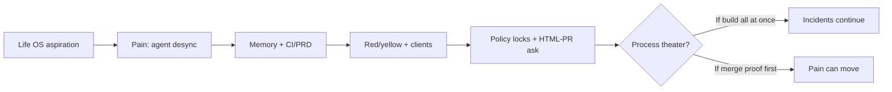

# DSKY plan — full-thread critical review

> Companion for `dsky-critical-review.canvas.tsx` · 2026-08-14  
> Also: `docs/canvases/dsky-critical-review.html`

## Verdict

Destination is right (multi-agent fund coordination). Plan is still too wide. Highest-value move is merge/deploy discipline on red paths — currently weakened by **GitHub Free private** lacking classic branch protection (API 403 this turn).

## Facts vs assumptions

| Item | Kind | Confidence | Notes |
|---|---|---|---|
| `dsky` private; protection API 403 | Fact | High | Verified via `gh api` |
| canvas-html ≠ GitHub PR format | Fact | High | Skill = HTML companions for canvases; GH PR bodies are Markdown |
| Live pin `v19_combined_hedge_gate_split_roll` | Fact | High | Present in ISBT variations / screening |
| Amber live-linked → RED; new BT-only variations → YELLOW | Decision | High | Your lock |
| Protect main + yellow automerge + red human review | Decision | High | Your lock; implementation constrained |
| Unabyss-full before merge proof | Bad sequencing | High | Opinion |

## History critique

1. Life OS framing was the wrong problem.  
2. Pain reveal should have restarted the plan.  
3. Full Unabyss kept scope inflated.  
4. Clients ≠ ingest.  
5. HTML-PR desire misreads canvas-html.

## Canvas-html and PRs

**Cannot** make GitHub PRs as canvas-html pages in the PR UI.

**Can:** Markdown PR template (required on red) · optional `docs/pr-briefs/<id>.html` linked from PR · Cursor `pr-review-canvas` for deep review.

## Protect main workarounds

1. Upgrade GitHub Pro/Team (real protection)  
2. Deploy-only enforcement (Railway/CI) — not equivalent  
3. Don’t trust local pre-push hooks for red  

## Locked path policy

- Live-linked modules (former amber): **RED**  
- New backtest-only variations: **YELLOW**  
- Need `live_variations` allowlist so CI can tell the difference  

## Sequenced next actions

1. GitHub Pro vs deploy-only workaround  
2. live_variations allowlist + CI classifier  
3. Red Markdown PR template  
4. Optional canvas-html brief linked from PR  
5. Defer Unabyss ingest until proof exists  

## Questions

1. Pro/Team vs deploy-only?  
2. Live-pinned list = only v19 today?  
3. Markdown only, or + HTML brief?  
4. WhatsApp capture rule?  
5. Ingest ≤2 sources?  
6. Slop / break-glass / headcount / Mem0 (still open)?  
7. Who CODEOWNs red?
