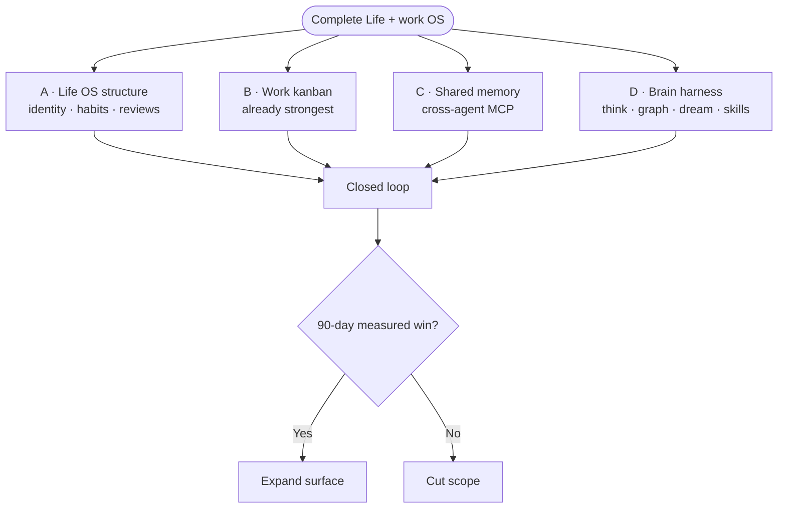
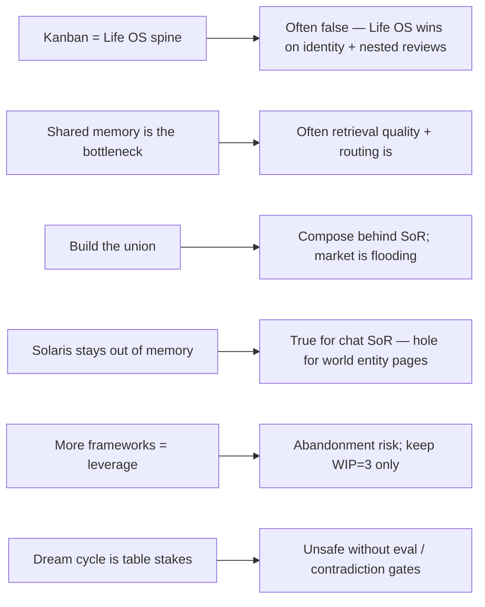
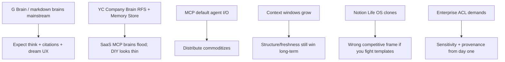
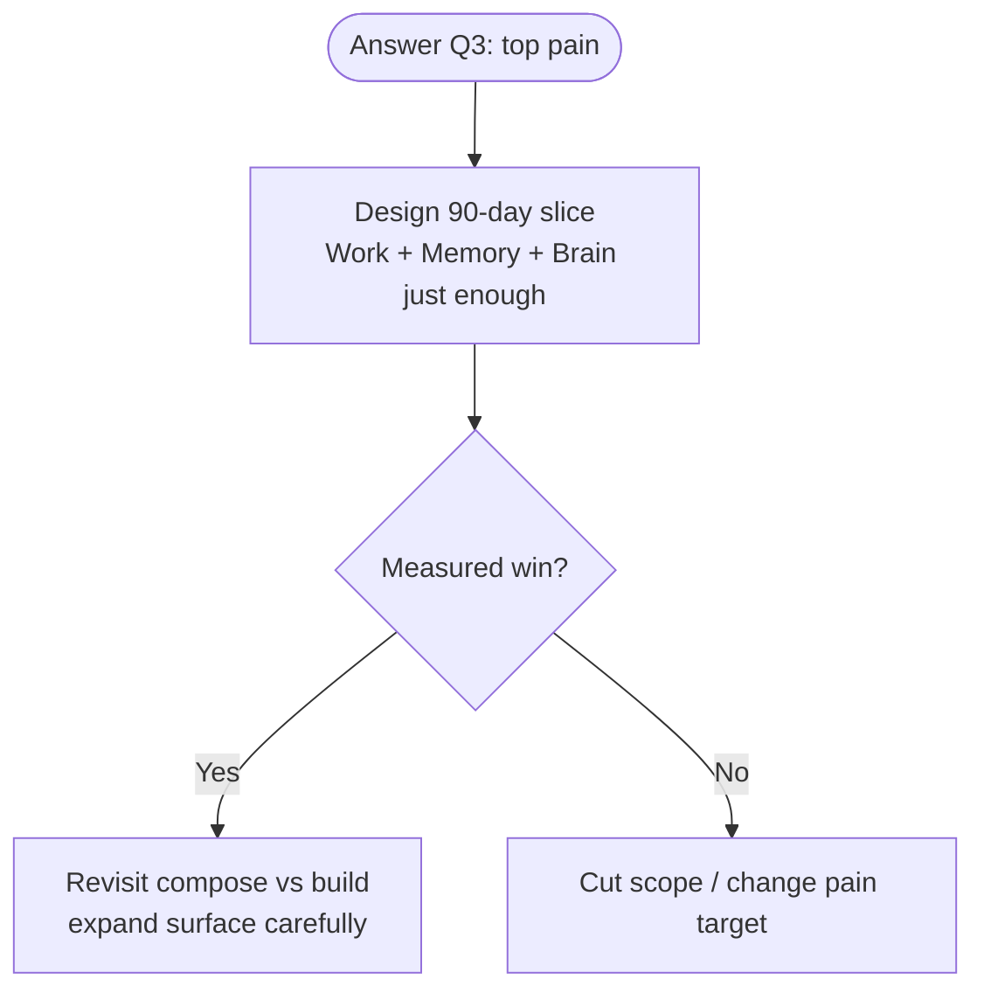

# Solaris Life OS — strategy brainstorm

> Companion docs for canvas: `solaris-life-os-brainstorm.canvas.tsx`  
> Generated: 2026-08-06 · Strategy brainstorm (not a build plan)

## Summary

Your ask fuses four products into one. The viable path is a **90-day closed loop** for one operator (capture → structure → execute → review → distill → synthesize), not feature parity with G Brain + Unabyss + Life OS. Competitive “market events” (YC Company Brain RFS, G Brain viral OSS, Memory Store, MCP commoditization) favor **composing engines behind clean SoR seams** and doubling down on Solaris’s unique wedge: **code-bound work execution**.

**Scope note:** “Market events” interpreted as category/competitive shocks. If you meant DSKY/financial markets, restart that brief separately.

## Request breakdown

| Part | Literal ask | Hidden requirement | Failure if ignored |
|---|---|---|---|
| A · Life + work OS | One system for life and work | Identity, habits, reviews, finance — not just tickets | Great kanban that never becomes a life OS |
| B · Kanban bulk | Board already does most of Work | Work is ~30–40% of the full goal | Over-invest in lanes; starve Memory/Brain |
| C · Deep shared memory | Claude ↔ ChatGPT ↔ Cursor ↔ Hermes | Ingest + permissioned MCP + SoR discipline | Agents stay amnesiac across tools |
| D · G Brain harness | Synthesize + structures + routines | Graph, think/gaps, dream cycle, skill packs | Vault grows; answers stay dumb |

## Assumptions challenged

| Assumption | Challenge | Contrary evidence |
|---|---|---|
| Kanban is the Life OS spine | Identity + nested reviews ≠ columns | Asana ~60% time on work-about-work; more schema can raise meta-work |
| Shared memory is the bottleneck | Connectivity ≠ quality | Mem0 LoCoMo ~64% vs ~91% full-context ceiling; category split (Mem0/Zep/Hindsight/GBrain) |
| Build the union yourself | Races capital/attention | YC S26 Company Brain RFS; Memory Store; G Brain ~28k stars; Hindsight ~13k |
| Plane purity forbids brain pages | Chat Memory ≠ world dossiers | G Brain brain≠memory≠session; AGENTS.md leaves entity-page home undefined |
| Port Life OS’s 47 frameworks | Framework density → abandonment | Keep empirically grounded WIP=3 (Weinberg multitasking loss); defer the rest |
| Unsupervised dream cycle | Writes confident wrongness | G Brain +31.4 P@5 is graph+citations; without gates, overnight jobs poison memory |

## Market events (category shocks)

| Event | Prepare by |
|---|---|
| G Brain UX becomes expected | Adopt brain≠memory routing; thin think/gap even before full graph |
| Company-brain capital flood | Own loop + SoR seams; buy commodity ingest |
| MCP everywhere | Every plane exposes MCP with per-tool scopes |
| Bigger context windows | Bet on graph + freshness + permissions, not raw tokens |
| Notion Life OS noise | Position agent-native; board is UI for agents+humans |
| Permission/audit pressure | Sensitivity tags + provenance at ingest |

### Data points (caveated)

| Claim | Number | Caveat |
|---|---|---|
| App toggles / day | ~1,200 | Often cited; methods vary |
| Time lost to switching / year | ~9% / ~5 weeks | HBR digital-worker framing |
| Interruptions / day (MS WTI 2025) | ~275 | Not all equal cost |
| Refocus after interrupt (Gloria Mark) | ~23 min | Canonical; often misquoted |
| Work about work (Asana) | ~60% | Search, status, coordination |
| G Brain graph lift (own bench) | +31.4 P@5 | Vendor corpus |
| Managed company-brain seats | ~$10–100/mo | Wide industry band |

## Ideas (exploration only)

1. **Thin conductor, thick vendors** — Solaris owns Work + Life schema + gate; swap brain/memory engines via MCP.
2. **Personal company-brain vertical slice** — meeting prep → entity pages → tasks → plan-close → Sunday review.
3. **Routines as code** — Life OS reviews = cron + agent plans, not Notion theater.
4. **Defend the wedge** — every synthesis becomes a board task with `agent_id`.
5. **Eval before dream** — golden queries; contradiction rate; fail closed.
6. **90-day non-goals** — no Profit First UI (DSKY), no 47 frameworks, no multi-tenant ACL.

## Risks and mitigations

| Risk | L | I | Mitigation |
|---|---|---|---|
| Boil the ocean | H | Fatal | 90-day slice; kill non-serving features |
| Plane pollution | H | H | Lint writes: brain≠memory≠session≠fact |
| Poisoned dream cycle | M | H | Citations; contradiction eval; human merge gate |
| Vendor lock / orphaned DIY | M | M | Markdown/git SoR for world pages; MCP adapters |
| Sensitivity leaks | M | H | Per-tool scopes; tag at ingest; audit reads |
| Meta-work tax | H | H | WIP=3; automate capture; measure use not pages |
| Competitive demoralization | H | M | Refuse parity; win on code-bound execution |
| Skillpack lock-in | M | M | Portable markdown skills in Team-Memory |

## Questions

1. Primary user for 12 months: you alone, or a small team?
2. “Market events” = category shocks, or DSKY/financial markets?
3. #1 weekly pain: re-explaining, meeting prep, habits, or execution chaos?
4. Where do world entity pages live (wiki / G Brain repo / Team-Memory)?
5. Willing to host G Brain/Hindsight, or build-in-house only?
6. Day-30 agent set: Cursor+Claude only, or also ChatGPT+Hermes+OpenClaw?
7. 90-day success metric?
8. Explicit non-goals?
9. Ops budget for overnight embeddings/LLM jobs?
10. If Unabyss/Memory Store solved distribute tomorrow, what must you still own?

## Decision rule

Pick the single pain. Close that loop. Defer the other products’ surface area until there is a measured win.
