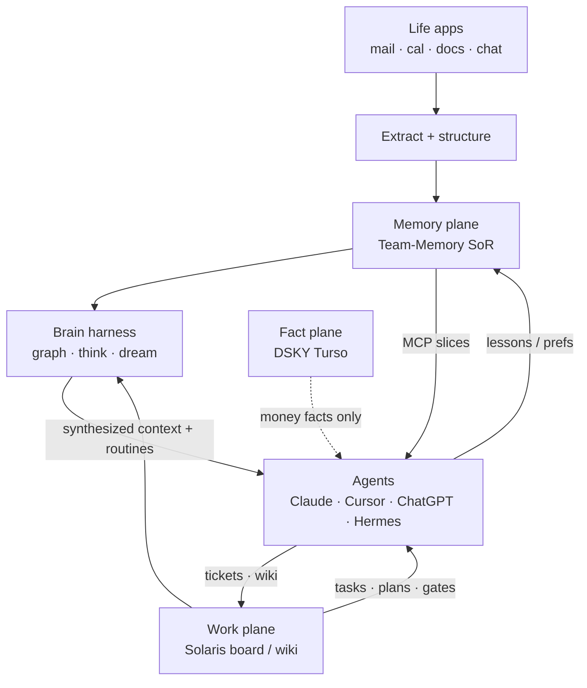
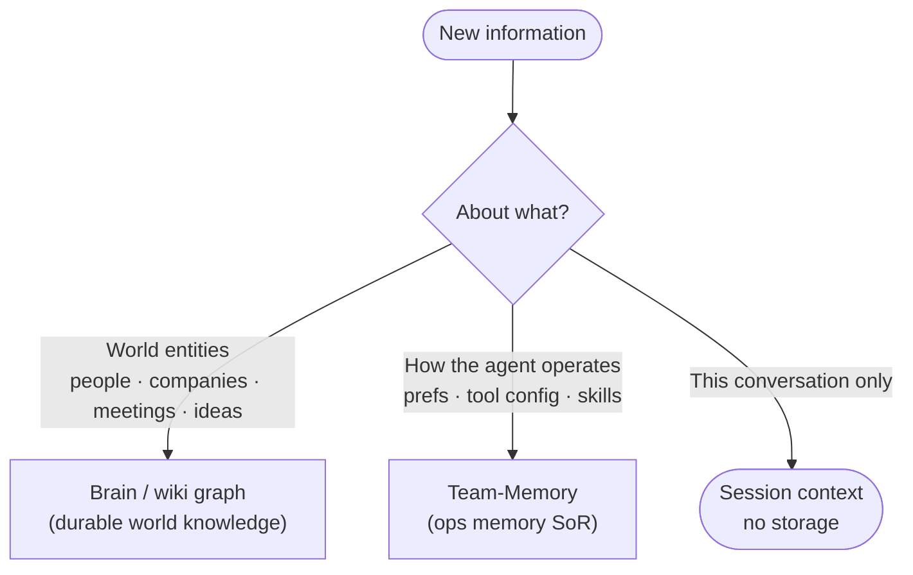
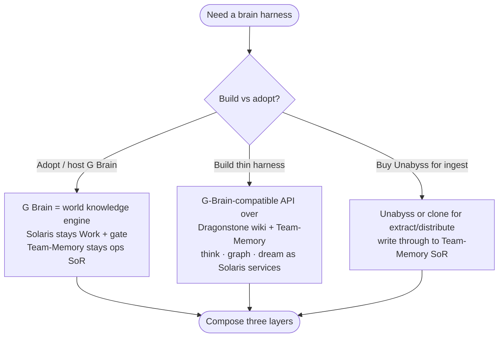

# Solaris as Life + Work OS

> Companion docs for canvas: `solaris-life-os-gap.canvas.tsx`  
> Generated: 2026-08-06 · Sources: [G Brain](https://github.com/garrytan/gbrain), [Unabyss](https://unabyss.com/how-it-works), [Life OS](https://lifeosdashboard.com/), Solaris `AGENTS.md` / `docs/`

## Summary

Solaris already owns the **Work** plane (kanban, plans, agent hard-gate, linked repos). The Life/work OS goal needs two more layers that are only partially present: an **Unabyss-shaped** shared context plane (Team-Memory is the SoR seam but ingest/distribute is thin), and a **G Brain-shaped** synthesis harness (graph, `think`, dream cycle, skills/routines) on top of wiki + memory. Life OS contributes the missing **human OS schema** — identity → goals → habits → nested reviews — which the board does not yet encode.

Do not collapse planes: keep Fact (DSKY), Memory (Team-Memory), Work (Solaris board/wiki), Code (linked repos), and add Brain as a harness — not a replacement for any of them.

## Target composition

## Product jobs

| Product | Job | What it owns | What it does not own |
|---|---|---|---|
| **G Brain** | World brain + agent harness | Markdown knowledge graph, hybrid search + synthesis (`think`), auto-link edges, overnight dream cycle, skill packs, brain≠memory≠session routing | Full Life OS identity/habits UX; Solaris-style code hard-gates |
| **Unabyss** | Cross-AI context layer | Connect sources → structure profile → distribute over MCP with per-tool control; two-way freshness | Work kanban execution; deep graph synthesis / gap analysis |
| **Life OS** | Human operating system | Identity, vision, GPS goals, ICE/DRIP, habits, nested D→Y reviews, finance UI, cascading report agents | Multi-agent MCP memory fabric; code-repo binding |
| **Solaris (today)** | Work + record OS | Kanban, initiatives, agent registry, plan-open/close, tag-along repos, Cursor hard-gate | Shared life-context ingest, brain synthesis, life-domain schema |

## Brain vs memory vs session (adopt this routing)

From G Brain’s `brain-vs-memory` guide — maps cleanly onto fleet planes:

| Layer | Store | Examples |
|---|---|---|
| World knowledge | Brain / wiki graph | “Pedro is CEO of Brex”, meeting notes, original theses |
| Operational memory | Team-Memory | “Prefer concise replies”, skill lessons, deploy prefs |
| Session | Chat window | “We were just discussing this PR” |

## Capability matrix

| Capability | Solaris now | G Brain | Unabyss | Life OS |
|---|---|---|---|---|
| Work kanban + agent execution gate | Strong | Partial | Missing | Partial |
| Cross-agent shared context (MCP) | Partial | Partial | Strong | Missing |
| App ingest (mail/cal/docs) | Missing | Partial | Strong | Missing |
| Knowledge graph + auto-link | Missing | Strong | Partial | Missing |
| Synthesized answers + gap analysis | Missing | Strong | Missing | Partial |
| Overnight consolidation / dream cycle | Missing | Strong | Partial | Missing |
| Skills / routines as harness | Partial | Strong | Missing | Partial |
| Identity → goals → habits reviews | Missing | Missing | Missing | Strong |
| Nested feedback (D/W/M/Q/Y) | Missing | Partial | Missing | Strong |
| Code-repo tag-along + hard gates | Strong | Missing | Missing | Missing |

## Priority gaps

1. **Shared context that syncs agents** — Team-Memory MCP is the Unabyss seam; flesh out ingest + recall quality + per-client wiring so Cursor sees what Hermes learned (scoped).
2. **Brain layer: synthesize, don’t just store** — cited answers, gap analysis, graph traversal, overnight consolidation on top of wiki + memory.
3. **Life structure on the work board** — identity, goals, habits, nested reviews as schema/instance overlay; cascading report agents as cron/plan jobs writing wiki + Team-Memory lessons.

## Strategic fork

Keep composing; avoid merging Memory into the vault or replacing the board with a Notion Life OS clone.

## Findings

- Your stated goal is the union of all three — and Solaris’s plane architecture already anticipates that split; the gap is implementation depth on Memory + Brain + Life schema, not a wrong core model.
- G Brain’s differentiator vs “another vault” is **synthesis + dream cycle**, not storage.
- Unabyss’s differentiator vs built-in AI memory is **owned, MCP-distributed, multi-tool SoT**.
- Life OS’s differentiator vs kanban is **identity-first nested feedback**, not task columns.
- Solaris’s unique wedge vs all three is **code-bound agent execution** (register → plan → task → hard-gate).
