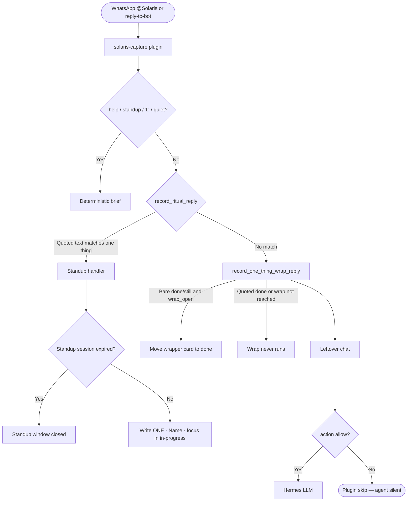
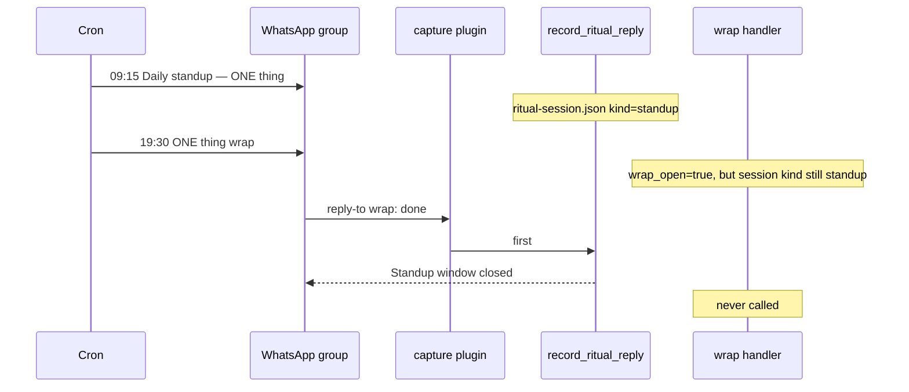
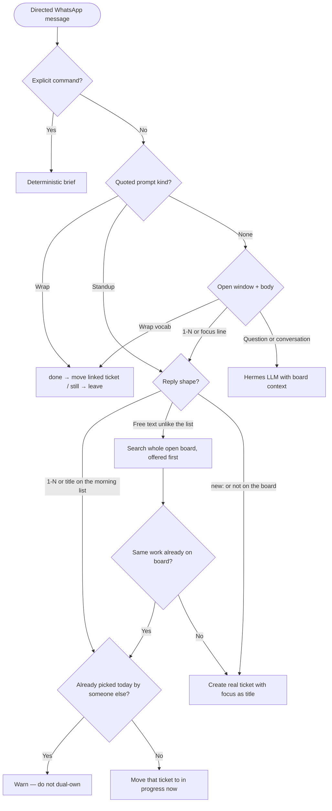
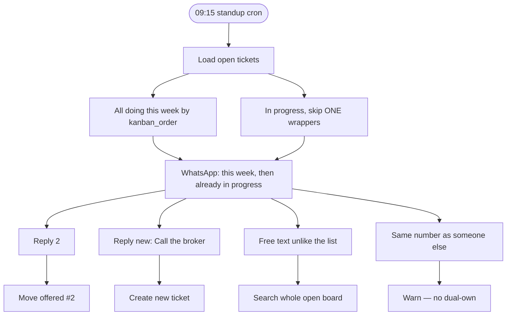

# Solaris Pod — WhatsApp intelligence

> Companion docs for canvas: `solaris-pod-whatsapp-intelligence.canvas.tsx`
> Generated: 2026-08-14 · Updated: this-week + in-progress pick list, full-board match, collision warn · Source: live Hermes solaris profile + `~/Solaris-agent` capture/ritual code; 13 Aug wrap cron copy; dsky-vault ONE-thing cards

## Summary

Solaris Pod intercepts directed WhatsApp messages with regex before the LLM sees them. Standup always creates a daily wrapper card (`ONE · Name · focus`) and never searches the Kanban board. Evening wrap replies are misread as standup because the wrap prompt contains “ONE thing” and leftover `ritual-session.json` is still `kind: standup`. The group therefore feels like a form, not a teammate.

## Current intercept

## Issue 1 — standup never picks an existing ticket

The 10 Aug ONE-thing plan specified a new card per person per day. That shipped in `create_or_update_one_thing_task`. It upserts `dsky/Tasks/Strategy/one-<date>-<owner>.md` and always sets `lane: in progress now`.

Your actual workflow: pick a ticket already in **backlog** or **doing this week** (todo) and work that today. Similar work should **move**. Only genuinely new work should mint a ticket.

13 Aug evidence: focus “setting up TastyTrade backtesting today” created `one-2026-08-13-devaang-mandalia.md` while Trading already had TastyTrade / backtest cards in backlog.

## Issue 2 — evening “done” treated as morning standup

Two concrete bugs:

1. `_STANDUP_CONTEXT_RE` matches `one thing`. Wrap title is “ONE thing wrap”.
2. Wrap handler runs **after** ritual, and does not strip `[Replying to: …]`, so even a first-position wrap handler would miss quoted `done`.

## Issue 3 — mechanical voice

Directed group messages that match ritual/command tables return `action: skip`. Hermes never reviews them. SOUL currently says standup is jot + ack, no thinking. That product choice is why the bot feels scripted.

## Target flow

### Morning pick list

The 09:15 standup lists **all of `doing this week`**, then **already in progress** (real tickets; daily `ONE ·` wrappers are skipped). Sort inside each section by `kanban_order` as it stands — humans will retune backlog ranking separately. Backlog is **not** padded onto the list. The numbered cards are stored on `ritual-session.json` as `offered[]`, so a reply of `2` is an exact move. Free text that is not on the list still searches the **whole open board** before minting.

### Match policy

| Situation | Action |
|---|---|
| Reply `1`–`N` (or `2. title`) | Move that offered ticket to `in progress now`. Record owner. |
| Reply matches an offered title | Move that offered ticket. |
| Free text unlike the list, same work already on the board | Move that ticket (LLM / Jaccard after the offered list). |
| `new: …` / “not on the board” / “completely different” | Create a ticket titled with the remaining line. |
| Two people pick the same card today | Warn. Do not dual-own. Ask if they still join or pick another. |
| Reply to wrap `done` | Move the **linked** ticket to `done`. |
| `@Solaris` question or conversation | Do not intercept. Agent converses. |

The Kanban board is the group board. Standup is for both teammates. No per-person menus.

## Ship plan

| Slice | Change | Done when |
|---|---|---|
| P0 | Quote-kind routing | Wrap vs standup never share a regex. Unwrap reply prefixes. Wrap handler first. Opening wrap sets ritual kind to `wrap`. |
| P1 | Board match on standup | LLM (Jaccard fallback) over open tickets. Skip old `ONE ·` wrappers. Ack says moved vs created. |
| P1b | This-week + in-progress pick list | Standup lists all doing this week, then already in progress (no ONE wrappers, no backlog padding). Reply `1–N` moves that card. Free text searches the whole board. `new: …` creates. Collision warns, no dual-own. |
| P2 | Intent pass-through | Questions and non-ritual directed chat go to Hermes. `?` lines are not stolen as focus. |
| Voice | SOUL + skill | Match the board first; converse when directed; still no coaching stack on a one-line check-in. |

Code lives in `~/Solaris-agent` (symlinked into `~/.hermes/profiles/solaris`). The profile `SOUL.md` is a copy, not a symlink.

## Notes / caveats

- Board SoR for this Pod is `~/dsky-vault` (`dsky/Tasks/`), not Dragonstone.
- LLM match should receive a shortlist (token-overlap top N), not the entire board, so WhatsApp latency stays bounded.
- Weak keyword overlap is not enough: “TastyTrade backtesting” vs “TastyTrade API keys” are related but not the same ticket. That is why the matcher is an LLM with a Jaccard fallback, not substring-only.
